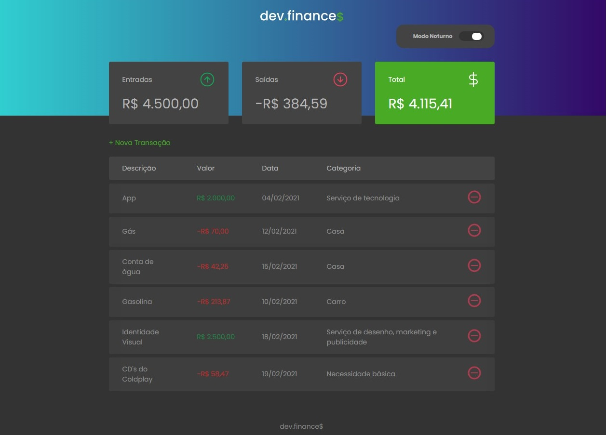

<h1 align="center">
  
</h1>

Site desenvolvido durante a <a href="https://maratonadiscover.rocketseat.com.br/inscricao">Maratona Discover</a>, com propósito de estudo.

Clique <a href="https://maratonadiscover.rocketseat.com.br/inscricao">aqui</a> para acompanhar a maratona.

  
  

  

## Participantes

[Igor Martins](https://github.com/igormartins4)

  

## Tecnologias

Esse projeto foi desenvolvido com as seguintes tecnologias:

- HTML
- CSS
- JavaScript
- localStorage
- Imagens SVG
  
## Acessar o projeto

Você pode clicar <a href="https://igormartins4.github.io/dev-finance/index.html">aqui</a> para acessar o site do projeto ou seguir os passos abaixo para rodar-lo localmente em sua máquina.

1. Clone o repositório
2. Abra a pasta do projeto no `VSCode`
3. Instale a extensão `Live Server`
4. Clique com o botão direito em `index.html` e depois vá em `Open with Live Server`
5. Acesse o **endereço gerado** em seu navegador.

## Projeto

O dev.finances é uma aplicação de controle financeiro, onde é possível cadastrar e excluir transações e ver o saldo de entrada e saída

## Layout

Você pode visualizar o layout do projeto através [desse link](https://www.figma.com/file/7Vu9DzUaCZIV4nibzkjgB4/dev.finance%24-Maratona-Discover). É necessário ter conta no [Figma](https://figma.com) para acessá-lo.

## Licença

Esse projeto está sob a licença MIT. Veja o arquivo [LICENSE](LICENSE.md) para mais detalhes.

## Milha Extra

Senti a necessidade de criação de um modo noturno para o site, com isso criei um botão para alternar as cores e salvá-las no localStorage. Além disso, criei um campo para colocar as categorias das despesas, para melhor organização. Para finalizar, o card que exibe o saldo total muda de cor, ficando vermelho caso o saldo total seja negativo.

<h3 align="center" >Bora fazer aquele networking maroto?</h3>

    <a href="https://www.linkedin.com/in/igormartins44/">LinkedIn</a> |
    <a href="https://www.instagram.com/titan.css">Instagram</a> |
    <a href="https://www.behance.net/titanstudio44">Behance</a>

 

    Desenvolvido com 💜 por Igor Martins 

